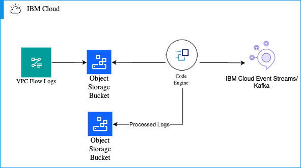

# VPC Flow logs to Kafka

IBM Cloud VPC Flow logs allow the collection and storage about the IP traffic going to and from network interfaces within your VPC. Please see [About IBM Cloud Flow Logs for VPC](https://cloud.ibm.com/docs/vpc?topic=vpc-flow-logs) for more information surrounding the service.

VPC Flow logs to Kafka utilizes Logstash to pull from an S3 COS Bucket, parses it, and send to Apache Kafka.  You can also use [IBM Cloud Event Streams](https://cloud.ibm.com/docs/EventStreams?topic=EventStreams-about) service which it built with Apache Kafka.



## Prerequisites

Before you run the VPC Flow logs to Kafka container, make sure you have the following:

1. HMAC credentials from IBM Cloud Object Storage instance that your IBM VPC Flow log bucket is in.
2. Backup Object Storage bucket to store processed VPC Flow logs
3. Object storage endpoint.
4. Kafka API key for the user `token`.
5. Kafka bootstrap servers.
6. Kafka topic.

## Running the container

### IBM Cloud Code Engine

You can run the container within [IBM Cloud Code Engine](https://cloud.ibm.com/codeengine/overview).  See the `terraform` directory to provision the necessary resources within IBM Cloud Code Engine.  

### Docker 

You can build and invoke the container by doing the following:

1. Clone this respository to your local space.
2. Build the container by running the following command: 
   ```sh
   docker build -t vpc-flow-logs-to-kafka .
   ```
3. Create and run a new container from an image.  Replace all values that are needed in each of the `< >` fields with your own:
   ```sh
   docker run --rm --env ACCESS_KEY_ID=<S3 ACCESS KEY ID> --env SECRET_ACCESS_KEY=<S3 SECRET ACCESS KEY> --env COS_BUCKET=<OBJECT STORAGE BUCKET WHERE FLOW LOGS ARE SENT> --env COS_BACKUP_BUCKET=<OBJECT STORAGE BUCKET FOR PROCESSED LOGS> --env BOOTSTRAP_SERVERS=<KAFKA BOOTSTRAP SERVERS> --env KAFKA_TOPIC=<KAFKA TOPIC> --env API_KEY=<KAFKA API KEY FOR USER token> vpc-flow-logs-to-kafka
   ``` 